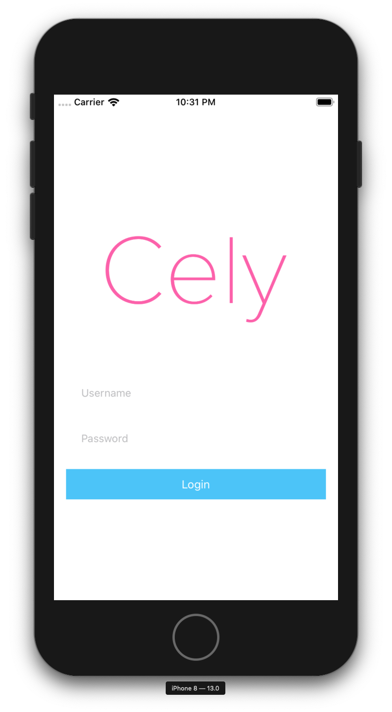

# Overview

This is a getting started guide will be using Cely's built-in customizable `LoginViewController`. If you would like to use your own login view controller checkout [setup own `LoginViewController`](TODO:)

<!-- Add install snippet here -->

<!--

Break down common app architecture with design


-->

## Cely Setup
Let's start by creating a `User` model that conforms to the [CelyUser](http://celylog.in/api/#celyuser) Protocol:


```swift
// User.swift

import Cely

struct User: CelyUser {

  enum Property: CelyProperty {
    case token = "token"
  }
}
```

Next, we'll implement [Cely.setup(:)](http://celylog.in/api/#setupwithformodelrequiredpropertieswithoptions) method inside of `application(_:willFinishLaunchingWithOptions:)` in `AppDelegate.swift`. As [Apple's documentation states](https://developer.apple.com/documentation/uikit/uiapplicationdelegate/1623032-application):

> This method is called after your app has been launched and its main storyboard or nib file has been loaded, but before your app’s state has been restored.


```swift
// AppDelegate.swift -- Swift 4.0

import Cely

class AppDelegate: UIResponder, UIApplicationDelegate {

    var window: UIWindow?

    func application(_ application: UIApplication, didFinishLaunchingWithOptions launchOptions: [UIApplication.LaunchOptionsKey: Any]?) -> Bool {
        Cely.setup(with: window, forModel: User(), requiredProperties: [.token], withOptions: [:])

        return true
    }
}
```

Now hit **RUN** on Xcode. You should see Cely's default Login Screen (below), don't worry you are able to customize this login page:




## Save Credentials

When the user clicks the **Login** button, we need away to retrieve the `username` and `password`, we do that by using the `.loginCompletionBlock` option:

```swift
Cely.setup(with: window, forModel: User(), requiredProperties: [.token], withOptions: [
    .loginCompletionBlock: { (username: String, password: String) in
        if username == "asdf" && password == "asdf" {
            Cely.save(username, forKey: "username")
            Cely.save("FAKETOKEN:\(username)\(password)", forKey: "token", securely: true)
            Cely.changeStatus(to: .loggedIn)
        }
    }
])
```


