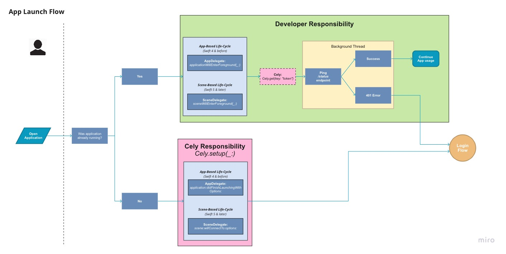
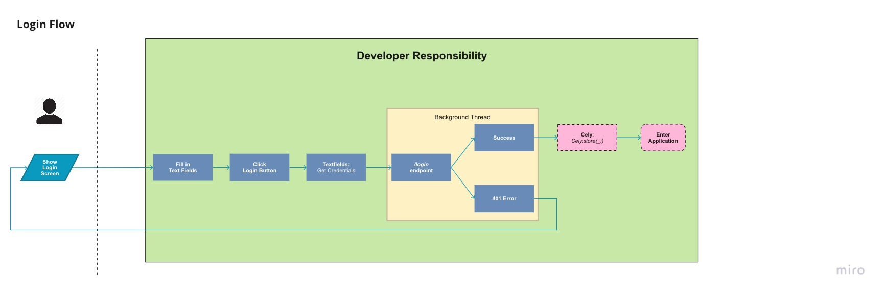

# Introduction

Loud Re-Authentication requires the user to re-authenticate everytime the application enters the foreground from a suspended or terminated state. In addition, it will require re-authentication once the session is no longer authenticated with the API.


## Loud Re-Authentication with Cely

In the next few sections were going to be going over Cely's role/responsibility in this flow and how to adopt it into your application.


## App Launch Flow



With the recent changes made to the [App's Life Cycle](https://developer.apple.com/documentation/uikit/app_and_environment/managing_your_app_s_life_cycle), depending on what version of iOS your application will support, you will need to call `Cely.setup(_:)` in different parts of your app's codebase. If your application supports iOS 12 or earlier, `Cely.setup(_:)` will be called in `application:didFinishLaunchingWithOptions` inside of `AppDelegate.swift`. If your application supports iOS 13 and later, `Cely.setup(_:)` will be called in `scene:willConnectTo:options:` inside of `SceneDelegate.swift`.

The rest of the guide will follow as if your application supports iOS 13 & later.

### Cely Responsibility

```swift
// iOS 13 | Swift 5.0 | Xcode 11.0
import Cely

struct User: CelyUser {

  enum Property: CelyProperty {
    case token = "token"
  }
}

class SceneDelegate: UIResponder, UIWindowSceneDelegate {
    var window: UIWindow?
    func scene(_ scene: UIScene, willConnectTo session: UISceneSession, options connectionOptions: UIScene.ConnectionOptions) {
        if let windowScene = scene as? UIWindowScene {
            let window = UIWindow(windowScene: windowScene)
            self.window = window
            window.makeKeyAndVisible()

            Cely.setup(with: window, forModel: User(), requiredProperties: [], withOptions: [
                .homeViewController: UIHostingController(rootView: HomeContentView()),
                .loginViewController: UIHostingController(rootView: LoginContentView())
            ])
        }
    }
}
```

Cely is configured to follow *Loud Authentication* by default if no `requiredProperties` are passed in. This protects the application from an unintended authentication state from occurring. As a brief explanation, we pass your application's `UIWindow` to give Cely access to switch inbetween your Login and Home Screen. Next, we pass an instance of our `User` model which contains the `Property` enum. And since no `requiredProperties` are passed in, Cely will redirect the user to the Login screen.

Under the assumption that the user has yet to log into the app, let's continue to the Login Flow.


### Developer Responsibility

```swift

class SceneDelegate: UIResponder, UIWindowSceneDelegate {

    ...

    func sceneWillEnterForeground(_ scene: UIScene) {

        // ping a `/status` endpoint to determine if token is still valid
        // 401 error occurred:
        guard let token = Cely.get(key: "token") as? String else { Cely.logout() }
        LoginService.status(token) { result in
           //...
        }
    }
}
```

```swift
class LoginService {

    static func status(token: String, completionHandler: @escaping (Result<Void?, Error>) -> Void) {
        API.status(token: token) { (result) in
            switch result {
            case .success(let token):
                return completionHandler(.success(nil))
            case .failure(let error):
                // handle error
                // Log user out
            }
        }
    }
}
```

## Login Flow



When the user successfully logs in, ensure the user's token is saved to keychain using `Cely.save(_:)` before calling the method `Cely.changeStatus(_:)` which will redirect the user to the home screen. Below is a pseudo code example:


```swift

let username = usernameTextField.text
let password = passwordTextField.text

Login.Service(username: username, password: password)
```

```swift
class LoginService {
    static func login(username: String, password: String) {
        API.login(username: username, password: password) { result in
            switch result {
            case .success(let token):
                if Cely.save(token, forKey: "token", securely: true) == .success {
                    Cely.changeStatus(to: .loggedIn)
                }
            case .failure(let error):
                // handle error
            }
        }
    }
}
```

Though a built-in `LoginViewController` is provided by Cely, as of Cely v3, it is encouraged for this built-in controller to only be used for rapid development/prototyping and not production.

## Conclusion

In conclusion, with this guide you should be given a high level overview of how to implement Loud Re-Authentication in your application using Cely. This document is a living document so if something is not clear or if you feel we are missing something, please open up an issue on this repo. The Cely team values documentation above all, so your help to improve it would greatly be appreciated 😀.
