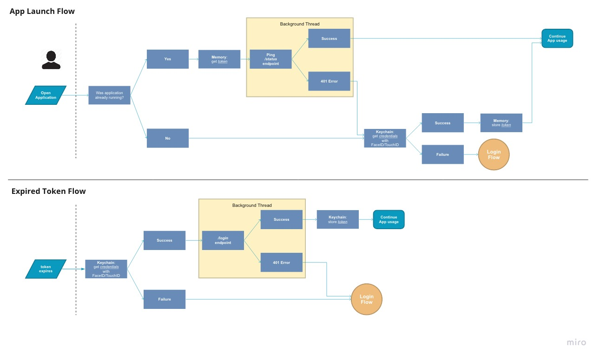

<!--
Authors:
- Fabian Buentello
-->

<!--
In this section:
- Mention plist
- FaceID/Touch ID is not supported with Cely's default loginViewController
- This is for more secure apps (bank apps, enterprise app)
-->

# Introduction

The Hybrid Re-Authentication Flow is an alternative flow you can use instead of Loud Re-Authentication. It acts as a "best of both worlds" solution. It keeps application data protected while keeping user interuption at a minimum. This is made possible by using biometric technologies such as FaceID or TouchID. You typically see such a flow with banking apps, enterprise apps, or any other apps that deal with sensitive information.

_Hybrid Re-Authentication Flow_


## Getting started

Before adding biometrics, its best to first understand what the difference is between [Loud Re-Authentication](/guides/loud_re-authentication_flow) and [Quiet Re-Authentication](/guides/quiet_re-authentication_flow). This guide will read as if your application already follows the Loud Re-Authentication flow. In the case that your application doesn't follow this flow one-for-one, feel free to make adjustments along the way. It is worth noting that Cely's default `loginViewController` does not support biometric login and requires for the developer to implement their own.

First, we need permission from the user's iPhone to use biometrics. Add the [`NSFaceIDUsageDescription`](https://developer.apple.com/documentation/localauthentication/accessing_keychain_items_with_face_id_or_touch_id/#3148680) key in your application's `Info.plist`. Next, we need to save the user credentials with biometrics by using the `.biometricsIfPossible` flag:

```swift
let credentialResult = Cely.credentials.set(
    username: username,
    password: password,
    server: "api.example.com"
    accessibility: [.biometricsIfPossible]
)

if case let .failure(error) = credentialResult {
    return print("Cely store credentials error: \(error)")
}
```

Now anytime the application tries retrieve the credentials using `Cely.credentials.get()`, the user will be prompted to authenticate using biometrics. Cely has no opinion on whether the retrieval of credentials should happen at the Login layer (display app's `loginViewController`) or the App/Scene Delegate layer (doesn't display `loginViewController`).


<!--
In this section:
- Display Hybrid Reauthentication Flow Diagram
- Explain how now anytime credentials are to be retrieved, Biometrics will be required
- Adding biometrics after the fact

TODO: what happens if:
- application doesnt have biometrics setup? and we try to save with `.biometricsIfPossible`, does it error?
- application turns off biometrics once they have already been saved
-->

<!--
In this section:
- introduce what this section is means
- go over some examples
- code example
-->

# Protect application functionality

<!--
https://developer.apple.com/documentation/localauthentication/logging_a_user_into_your_app_with_face_id_or_touch_id
 -->
