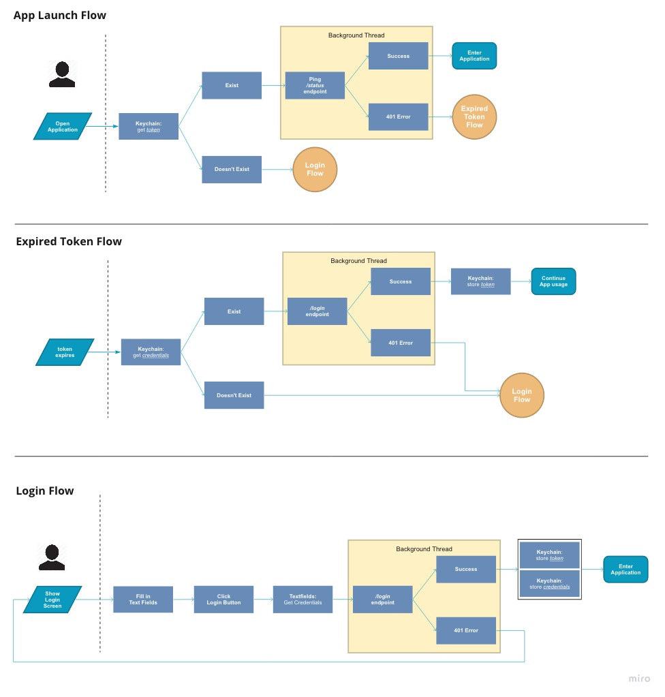

## Overview

The purpose of these guides are to not only give more in-depth usage of Cely's API, but to also educate readers on what should be considered best practices when creating your application's authentication flow. Though these guides will be using Cely, the concepts/practices mentioned can be applied without Cely.

First, you have to decide what type of Re-Authentication Flow makes the most sense for your application. The two types of Re-Authentication flows are:

- *Quiet Re-Authentication*
- *Loud Re-Authentication*

These flows are not mutually exclusive. A Hybrid approach can be taken using functionality such as FaceID or TouchID.

## Quiet Re-Authentication Flow

_Most iOS apps use this flow_

Not to be confused with [Silent Authentication](https://auth0.com/docs/api-auth/tutorials/silent-authentication) from the OAuth2 spec. *Quiet Re-Authentication* allows for an app to re-authenticate without requiring user interaction by using Keychain Services. This is done by storing the user's credentials (username & password) in Keychain and later retrieving them when the app needs to re-authenticate. You typically see this in application where the user is expecting immediate use from the application, such as social media apps, entertainment apps, and shopping apps.

As far as the user is concerned, they only had to login once.

This flow protects your application in the case where the user's password is updated on the web and you need to prompt the user to re-authenticate via a Login Screen. There are a few other cases where prompting the user to re-authenticate might be necessary in this flow, such as restoring the application from backup onto another device or the user disabling FaceID/TouchID on device. Both of which will be covered in [Add Control List to Cely Credentials](TODO:).

## Loud Re-Authentication Flow

*Loud Re-Authentication* requires the user to re-authenticate everytime the application is being launched from a Suspended or Terminated State. Loud Re-Authenticating apps **do not retain authenticating information**, such as `token`, past the allocated memory for the application. Meaning, once your application is in the [Suspended or Terminated State](https://developer.apple.com/documentation/uikit/app_and_environment/managing_your_app_s_life_cycle), the application will require for the user to log back in.

In the case that your application has stayed in the Background State long enough for the `token` to become expired, the above flow allows you to gracefully transition the application to the Login Screen. Preventing the user from interacting with the View that was initially displayed. You'll see this flow mostly with apps that contain very sensitive information such as banking apps or internal enterprise apps.

## Hybrid Re-Authentication Flow

The Hybrid Re-Authentication Flow is an alternative flow you can use instead of Loud Re-Authentication. It acts as a "best of both worlds" type of solution. It keeps application data protected while keeping user interuption at a minimum. This is made possible by using technologies such as FaceID or TouchID.

