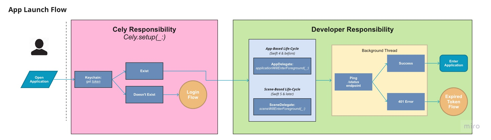

# Introduction

*Quiet Re-Authentication* allows your application to reauthenticate in the background without requiring the user to login. Below is a diagram illistrating the steps your application should take when adopting this flow.

*Quiet Re-Authentication Flow*


## Quiet Re-Authentication with Cely

In the next few sections were going to be going over Cely's role/responsibility in this flow and how to adopt it into your application.

## App Launch Flow

<!--
In this section:
I want to go over the "app launch flow with cely" diagram.
-->





#### Cely Responsibility

<!--
In this section:
I want to go over the Cely's responsibility during the "app launch flow"
-->

With the recent changes made to the [App's Life Cycle](https://developer.apple.com/documentation/uikit/app_and_environment/managing_your_app_s_life_cycle), depending on what version of iOS your application will support, iOS 12 and earlier or iOS 13 and later — you will need to call `Cely.setup(_:)` in different parts of your app's codebase.

The rest of the guide will follow as if your application supports iOS 13 & later. In the next section we will shift our focus to `scene(_:willConnectTo:options:)`


```swift
// iOS 13 | Swift 5.0 | Xcode 11.0
import Cely

struct User: CelyUser {

  enum Property: CelyProperty {
    case token = "token"
  }
}

class SceneDelegate: UIResponder, UIWindowSceneDelegate {
    var window: UIWindow?
    func scene(_ scene: UIScene, willConnectTo session: UISceneSession, options connectionOptions: UIScene.ConnectionOptions) {
        if let windowScene = scene as? UIWindowScene {
            let window = UIWindow(windowScene: windowScene)
            self.window = window
            window.makeKeyAndVisible()

            Cely.setup(with: window, forModel: User(), requiredProperties: [.token], withOptions: [
                .homeViewController: UIHostingController(rootView: HomeContentView()),
                .loginViewController: UIHostingController(rootView: LoginContentView())
            ])
        }
    }
}
```

As a brief explanation, we pass your application's `UIWindow` to give Cely access to switch inbetween your Login and Home Screen. Next, we pass an instance of our `User` model which contains the `Property` enum. Finally, using the `requiredProperties` parameter, we tell Cely what properties are required in order to continue to the `.homeViewController`. In this example, if Cely does not find a property `.token` in its storage, or if `requiredProperties` is empty, Cely will redirect the user to `.loginViewController`.


#### Developer Responsibility

<!--
In this section:
I want to go over the Developer's responsibility during the "app launch flow"
-->

Below is an example of what is required of the developer to implement in order to complete the App Launch Flow for *Quiet Re-Authentication*. We check to see if the user is logged in — then retrieve the `token`. If no token is returned then we log the user out. Next, we check to see if the user's token is expired. If the token is expired we logout the user. We will finish writing `sceneWillEnterForeground(_:)` in the **Expired Token Flow**.

```swift
class SceneDelegate: UIResponder, UIWindowSceneDelegate {

    ...

    func sceneWillEnterForeground(_ scene: UIScene) {
        if Cely.isLoggedIn() {
            guard let token = Cely.get(key: "token") as? String
                else { return Cely.logout() }

            LoginService.status(for: token) { result in
                switch result {
                case .success:
                case .failure(let error as HTTPError) where error == .unauthorized:
                    // TODO: Revisit in Expired Token Flow
                }
            }
        }
    }
}
```

```swift
class LoginService {
    static func status(for token: String, completionHandler: @escaping (Result<Void?, Error>) -> Void) {
        // make API call to check token status
        completionHandler(someResult)
    }
}
```


## Login Flow

<!--
In this section:
I want to go over the "login flow with cely" diagram.
-->


Though a built-in `LoginViewController` is provided by Cely, as of Cely v3, it is encouraged for this built-in controller to only be used for rapid development/prototyping and not production. In this example, once the API has authenticated our credentials we save the `token` in keychain using `Cely.save(_:)`. If successful, we also store the user credentials in keychain using `Cely.credentials.set(_:)`. Lastly, we change the user's logged in status with cely using `Cely.changeStatus(_:)` which will transition our application to the `.homeViewController`. Below is a pseudo code example:

```swift
// LoginViewController.swift

let username = usernameTextField.text
let password = passwordTextField.text

Login.Service(username: username, password: password)
```

```swift
class LoginService {

    ...

    static func login(username: String, password: String) {
        API.login(username: username, password: password) { result in
            switch result {
            case .success(let token):
                if Cely.save(token, forKey: "token", securely: true) == .success {
                    Cely.credentials.set(
                        username: username,
                        password: password,
                        server: "api.example.com"
                    )
                    Cely.changeStatus(to: .loggedIn)
                }
            case .failure(let error):
                // handle error
            }
        }
    }
}
```

## Expired Token Flow

<!--
In this section:
I want to go over the "expired token flow with cely" diagram.
-->


If you come from a Backend development background, the idea of implementing a [refresh token](https://auth0.com/learn/refresh-tokens/) to handle re-authentication may seem like the best option, but its going to cost a bit of overhead and precious developer time. Instead, because of the security Keychain Services provides, we are able to [store users credentials directly onto the device](https://developer.apple.com/documentation/security/keychain_services/keychain_items/adding_a_password_to_the_keychain), making re-authentication extremely easy. How does Cely help us do this?

Up until this point we have stored the API token in Keychain Services using `Cely.save(_:)`, but it is expected for this token to eventually expire. When it does expire, we will be receiving `401` errors from our API. Since we are following the *Quiet Re-Authentication Flow*, our application will re-authenticate the user instead of logging them out.

There are two places where we need to handle Re-authentication.

- When the app launch, *(if the user is already logged in)*
- When an API request returns `401` error

#### App Launch

With Scene based life-cycle events `sceneWillEnterForeground(_:)` will get called every time your application enters the foreground, regardless if its from a terminated/suspended state or background state.

Below is a pseudo code example for when the application starts up:

<!--
In this section:
I want to go over the methods [and actions] needed in `SceneDelegate` in order to handle a unauthenticated user during App Launch
-->

```swift

class SceneDelegate: UIResponder, UIWindowSceneDelegate {

    ...

    func sceneWillEnterForeground(_ scene: UIScene) {
        guard Cely.isLoggedIn() else { return }

        guard let token = Cely.get(key: "token") as? String
            else { return Cely.logout() }

        LoginService.status(for: token) { result in
            switch result {
            case .success:
            case .failure(let error as HTTPError) where error == .unauthorized:
                // * HERE *
                let credentials = Cely.credentials.get()
                LoginService.reAuthenticate(username: credentials.username, password: credentials.password) {
                  // ...
                }
            }
        }
    }
}
```

```swift
class LoginService {

    ...

    static func reAuthenticate(username: String, password: String, completionHandler: @escaping (Result<Void?, Error>) -> Void) {
        API.login(username: username, password: password) { (result) in
            switch result {
            case .success(let token):
                if Cely.save(token, forKey: "token", securely: true) == .success {
                    return completionHandler(.success(nil))
                }
            case .failure(let error):
                // handle error
                // Log user out
            }
        }
    }
}
```

#### Handle `401` errors from API

<!--
In this section:
I want to go over whats needed in order to reauthenticate a user on a 401 response
-->

It is up to the developer's discretion on how the second example, *API request returns `401` error*, will be architected. But essentially, you will need to do the following:

- Intercept a failed response from an API request
- Re-Authenticate user
    - on success:
        - re-request failed API request and continue original call sequence
    - on failure:
        - log user out


```swift

class SomeService {

    static func getSomeData(with id: String, completionHandler: @escaping (Result<Void?, Error>) -> Void) {
        API.someEndpoint(id: id) { (result) in
            switch result {
            case .success(let data):
                // do something with data
            case .failure(let error as HTTPError) where error == .unauthorized:
                let credentials = Cely.credentials.get()
                return LoginService.reAuthenticate(username: credentials.username, password: credentials.password) { (result) in
                    switch result {
                    case .success(let token):
                        // * UPDATE TOKEN *
                        if Cely.save(token, forKey: "token", securely: true) == .success {
                            return SomeService.getSomeData(with: id, completionHandler: completionHandler)
                        }
                    case .failure(let err as HTTPError) where err == .unauthorized:
                        // handle error
                        // Log user out
                    }
                }
            }
        }
    }
}
```
Upon success, since the credentials used to re-authenticate are still valid, **only** update the `token` to avoid multiple expensive calls.

## Conclusion

In conclusion, with this guide you should be given a high level overview of how to implement *Quiet Re-Authentication* in your application using Cely. This document is a living document so if something is not clear or if you feel we are missing something, please open up an issue on this repo. The Cely team values documentation above all, so your help to improve it would greatly be appreciated 😀.
