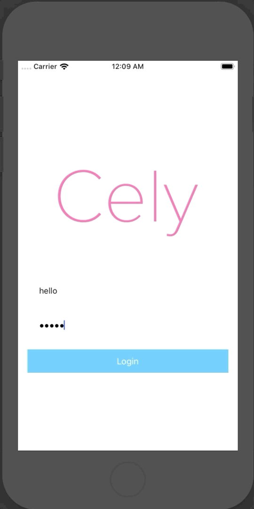

## `.celyAnimator`

In order to override the transition animations when loggin in, you must create a `class`/`struct` that conforms to the [`CelyAnimator` protocol](TODO:). Instead of transition from `Left -> Right`, in the example below we are transitioning from `Top -> Bottom`. Feel free to use any animation frameworks/libraries within `loginTransition(_:)` or `logoutTransition(_:)`.


```swift
struct VerticalAnimator: CelyAnimator {
    func loginTransition(to destinationVC: UIViewController?, with celyWindow: UIWindow) {
        if let snapshot = celyWindow.snapshotView(afterScreenUpdates: true) {
            destinationVC?.view.addSubview(snapshot)
            celyWindow.setCurrentViewController(to: destinationVC)


            UIView.animate(withDuration: 0.5, animations: {
                snapshot.transform = CGAffineTransform(translationX: 0.0, y: 1000.0)
            }, completion: { (value: Bool) in
                snapshot.removeFromSuperview()
            })
        }
    }

    func logoutTransition(to destinationVC: UIViewController?, with celyWindow: UIWindow) {
        if let snapshot = celyWindow.snapshotView(afterScreenUpdates: true) {
            destinationVC?.view.addSubview(snapshot)
            celyWindow.setCurrentViewController(to: destinationVC)


            UIView.animate(withDuration: 0.5, animations: {
              snapshot.transform = CGAffineTransform(translationX: 0.0, y: -1000.0)
            }, completion: {(value: Bool) in
                snapshot.removeFromSuperview()
            })
        }
    }
}
```

Now to set this animation, add `.celyAnimator` to `withOptions:` in `Cely.setup(_:)`:

```swift
// AppDelegate.swift
Cely.setup(with: window, forModel: User(), requiredProperties: [.token], withOptions: [
    .celyAnimator: VerticalAnimator()
    // ...
])
```

You application should now transition from `Top -> Bottom`:


