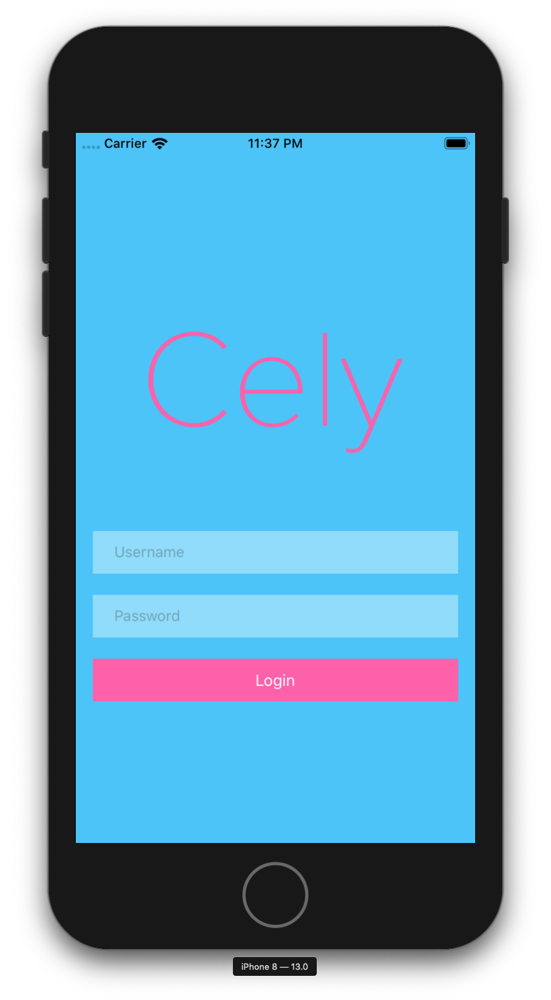

## `.loginStyle`

As of Cely's version 2.x.x, the built-in `LoginViewController` is more for rapid development/prototyping with the expectation that the developer will eventually configure Cely with their own `LoginViewController`. That's not to say that the role that Cely's built-in `LoginViewController` won't change in the future to include more customizable features and can become an overall end solution for some applications.

As of this writing, simply create a `class`/`struct` that conforms to the `CelyStyle`. Please refer to [`CelyStyle`](http://celylog.in/api/#celystyle) for more information on what's customizable. Here is an example:

```swift
struct CottonCandy: CelyStyle {
    func backgroundColor() -> UIColor {
        return UIColor(red: 86/255, green: 203/255, blue: 249/255, alpha: 1)
    }
    func buttonTextColor() -> UIColor {
        return .white
    }
    func buttonBackgroundColor() -> UIColor {
       return UIColor(red: 253/255, green: 108/255, blue: 179/255, alpha: 1)
    }
    func textFieldBackgroundColor() -> UIColor {
        return UIColor.white.withAlphaComponent(0.4)
    }
    func appLogo() -> UIImage? {
        return UIImage(named: "CelyLogo")
    }
}
```
Now to set this style, add `.loginStyle` to `withOptions:` in `Cely.setup(_:)`:

```swift
// AppDelegate.swift
Cely.setup(with: window, forModel: User(), requiredProperties: [.token], withOptions: [
    .loginStyle: CottonCandy(),
    // ...
])
```

Your built-in screen should've changed to:


