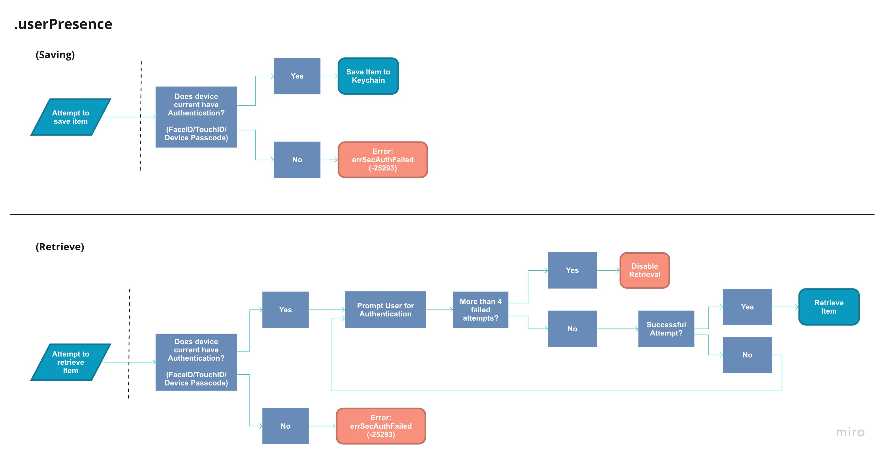
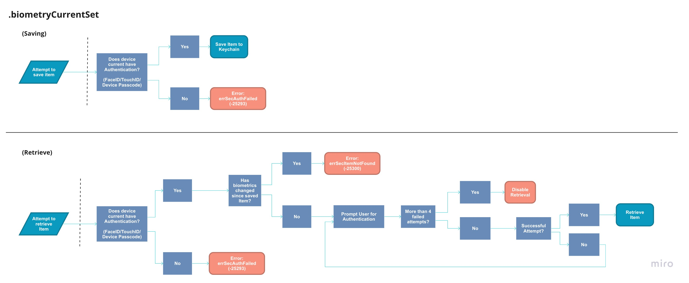

---

## Add FaceID/TouchID

### Access Control

<!--
In this section:
- NSFaceIDUsageDescription
- I want to explain what `kSecAttrAccessControl` is and why is it important.
- relationship between `kSecAttrAccessible` and `kSecAttrAccessControl`
  - what happens if you set conflicting accessible attributes (`kSecAttrAccessControl` & `kSecAttrAccessible`)?!
    - Result: you get a -50 error
-->

The [`kSecAttrAccessControl`](https://developer.apple.com/documentation/security/ksecattraccesscontrol) attribute is what allows you to add additional authentication such as `FaceID`, `TouchID`, Device Password, etc. You must set `kSecAttrAccessControl` attribute to a [`SecAccessControl`](https://developer.apple.com/documentation/security/secaccesscontrol) object. You do this by using the [`SecAccessControlCreateWithFlags(_:)`](https://developer.apple.com/documentation/security/1394452-secaccesscontrolcreatewithflags) function.

_Below is its declaration:_
```swift
func SecAccessControlCreateWithFlags(_ allocator: CFAllocator?,
                                   _ protection: CFTypeRef,
                                   _ flags: SecAccessControlCreateFlags,
                                   _ error: UnsafeMutablePointer<Unmanaged<CFError>?>?) -> SecAccessControl?
```

Below are the parameters for this function:

| Parameter | Description | Example |
|------------|----------|----------------------------|
| `allocator:` | An optional object that allocates/reallocates/deallocates memory for Core Foundation objects | `nil` |
| `protection:` | This will be an [Accessibility Value](https://developer.apple.com/documentation/security/keychain_services/keychain_items/item_attribute_keys_and_values#1679100) | `kSecAttrAccessibleWhenUnlocked` |
| `flags:` | This will either be a single [SecAccessControlCreateFlags](https://developer.apple.com/documentation/security/secaccesscontrolcreateflags) or an Array of `SecAccessControlCreateFlags`. | `.userPresence` or `[.biometryCurrentSet, .or, .devicePasscode]` |
| `error:` | Pointer to error object. | `nil` |


_example_

```swift
var error: Unmanaged<CFError>? = nil
let access = SecAccessControlCreateWithFlags(nil,
                                            kSecAttrAccessibleWhenUnlocked,
                                            .userPresence,
                                            &error)
```

### Flags

<!--
In this section:
I want to go over the different flags and what type of errors to expect in certain scenarios
-->

In this section we will be going over some of the flags you can set and what errors you may encounter. In you want to see the entire list of flags, please checkout [`SecAccessControlCreateFlag`](https://developer.apple.com/documentation/security/secaccesscontrolcreateflags) for more information.

Flags we will go over:

- `.userPresence` - FaceID/TouchID/Device Passcode.
- `.devicePasscode` - Device Passcode only.
- `.biometryAny` - FaceID/TouchID only (allows for biometrics changes).
- `.biometryCurrentSet` - FaceID/TouchID only (invalidates item when biometrics change).
- `.applicationPassword` - Application Specific password.

#### NSFaceIDUsageDescription

When using `.userPresence`, if [`NSFaceIDUsageDescription`](https://developer.apple.com/documentation/bundleresources/information_property_list/nsfaceidusagedescription) is not set in your plist, your application will revert to prompting the user for the Device Passcode. But when using `.biometryAny` or `.biometryCurrentSet`, failing to set `NSFaceIDUsageDescription` will result in your application crashing with the following error:

```text
ERROR: This app has crashed because it attempted to access privacy-sensitive
data without a usage description. The app's Info.plist must contain
an NSFaceIDUsageDescription key with a string value explaining to
the user how the app uses this data.
```

#### .userPresence

[`.userPresence`](https://developer.apple.com/documentation/security/secaccesscontrolcreateflags/1392879-userpresence) is more than likely the flag you would be using in your application. Other flags such as `.devicePasscode` and `.biometryAny`, are simply slight derivatives of this flag.



Above is the flow you can expect for your application to take when saving/retrieving a Keychain Item with the `.userPresence` flag. **It is very possible to encounter an [`errSecAuthFailed`](https://developer.apple.com/documentation/security/errsecauthfailed) error when retrieving `.userPresence` flagged items**. This happens if the user removes the device passcode after an `.userPresence` flagged item has already been saved. In addition, If the user adds back a passcode to the device *(it doesn't have to be the same passcode)* the item can once again be retrieved.


#### .biometryCurrentSet

The flag that differs from `.userPresence` the most would be [.biometryCurrentSet](https://developer.apple.com/documentation/security/secaccesscontrolcreateflags/2937192-biometrycurrentset), it invalidates any Keychain Items once a finger is added or removed for TouchID or if the user re-enrolls for FaceID.



#### .applicationPassword

The last flag we will go over is [.applicationPassword](https://developer.apple.com/documentation/security/secaccesscontrolcreateflags/1617930-applicationpassword), this allows for the user to set an application specific passcode in order to retrieve the item. When using this flag, iOS will prompt the user to insert a passcode. Meaning, you don't need to worry about providing a view to capture the application password. Unlike retrieving an item using device security such as `.devicePasscode`, after 5 failed attempts, Keychain returns the error `errSecAuthFailed` instead of disabling the item retrieval. Meaning, after 5 failed attempts the user can simply try again without being penalized.


#### Combining Flags

In the case you want to authenticate the user with both `.userPresence` and `.applicationPassword`, you may combine them using an array.

```swift
var error: Unmanaged<CFError>? = nil
let access = SecAccessControlCreateWithFlags(nil,
                                            kSecAttrAccessibleWhenUnlocked,
                                            [.userPresence, .applicationPassword],
                                            &error)
```

Some combinations are not allowed such as `[.userPresence, .devicePasscode]`, so be sure to print out the `error` for more information.

### Usage

Next we will go over how to set `kSecAttrAccessControl` in order to add authentication such as FaceID or TouchID when retrieving an item from Keychain.

_create example:_

```swift
@IBAction func saveWithAccessFlagClicked(_ sender: Any) {
    var error: Unmanaged<CFError>? = nil
    guard let access = SecAccessControlCreateWithFlags(nil,
                                                      kSecAttrAccessibleWhenUnlocked,
                                                      .userPresence,
                                                      &error) else { return }

    let query: [CFString: Any] = [
        kSecClass: kSecClassInternetPassword,
        kSecAttrAccessControl: access,
        kSecAttrServer: "example.com",
        kSecAttrAccount: "username",
        kSecValueData: "some-password".data(using: String.Encoding.utf8)!
    ]

    let status = SecItemAdd(query as CFDictionary, nil)
    guard status == errSecSuccess else {
        print("status:", status)
        return
    }

    print("successfully saved with access attribute")
}
```

Upon retrieval of this item, using the query example below, the user will be asked to authenticate either using `FaceID`, `TouchID` or with the Device Password.

_retrieve example_
```swift
@IBAction func QueryClicked(_ sender: Any) {

    let query: [CFString: Any] = [
        kSecClass: kSecClassInternetPassword,
        kSecAttrServer: "example.com",
        kSecAttrAccount: "username",
        kSecReturnAttributes: true,
        kSecReturnData: true
    ]

    var someItem: CFTypeRef?
    let status = SecItemCopyMatching(query as CFDictionary, &someItem)
    guard status == errSecSuccess else {
        print("status:", status)
        return
    }

    guard let item = someItem,
        let username = item[kSecAttrAccount] as? String,
        let passwordData = item[kSecValueData] as? Data,
        let password = String(data: passwordData, encoding: .utf8)
    else {
        print("Item not found")
        return
    }

    print("username:", username)
    print("password:", password)
}
```

### kSecUseAuthenticationUISkip

<!--
In this section:
- Querying Keychain and returns 2 items, one of which is protected by faceID. - What happens?
- go over:
  - [kSecUseAuthenticationUISkip](https://developer.apple.com/documentation/security/ksecuseauthenticationuiskip) - Silently skip any items that require user authentication.
-->

Depending on how broad your search is when querying Keychain, you may be returned an item that has `kSecAttrAccessControl` set. Even though this might not be the item you are looking for, the user will be required to authenticate using whatever `SecAccessControlCreateFlag` the item was set to. Meaning, if a result is returned that requires FaceID authentication, the user will be required to authenticate. This might not be the best user experience depending on your application. You can exclude these items by using the [`kSecUseAuthenticationUI`](https://developer.apple.com/documentation/security/ksecuseauthenticationui) attribute.

```swift

@IBAction func QueryAllClicked(_ sender: Any) {

    let query: [CFString: Any] = [
        kSecClass: kSecClassInternetPassword,
        kSecMatchLimit: kSecMatchLimitAll,
        kSecUseAuthenticationUI: kSecUseAuthenticationUISkip,
        ...
    ]

    var someItem: CFTypeRef?
    let status = SecItemCopyMatching(query as CFDictionary, &someItem)
    ...
```

#### Notes

When setting a `kSecAttrAccessControl` attribute on your Keychain Item, you cannot set the `kSecAttrAccessible` attribute on the Keychain Item itself. Doing so will result in a `errSecParam` error, even if both are set to the same value. As an example, the following will return an error:

```swift
var error: Unmanaged<CFError>? = nil
guard let access = SecAccessControlCreateWithFlags(nil,
                                                  kSecAttrAccessibleWhenUnlocked, // <--
                                                  .userPresence,
                                                  &error) else { return }

let query: [CFString: Any] = [
    kSecAttrAccessControl: access,
    kSecAttrAccessible:kSecAttrAccessibleWhenUnlocked, // <--
    ...
]

let status = SecItemAdd(query as CFDictionary, nil) // equals -50 (errSecParam)
```


