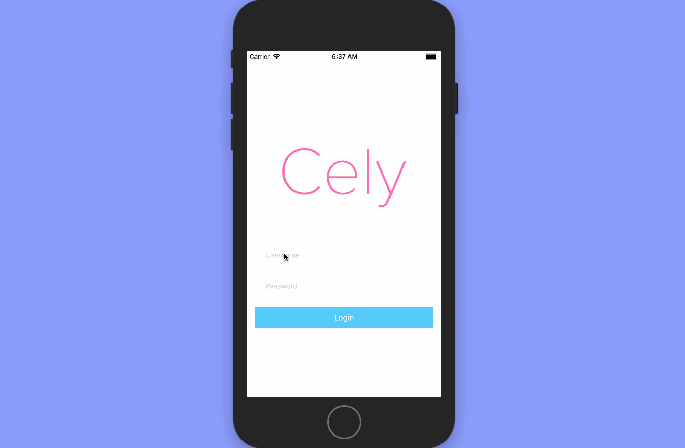

{!docs/includes/why-cely.md!}

|     | Cely                                              |
| --- | ------------------------------------------------- |
| 🚤  | Add login functionality in a fraction of the time |
| 🔏  | Store user information securely with Keychain     |
| 📖  | 100% open source under the MIT license            |
| ☄️  | Battle tested architecture                        |
| 👶  | Simple and intutive API design                    |
| ⚖️  | Easily Add/Remove from existing codebase 🤗       |

## Questions and support

Before submitting a new GitHub issue, please make sure to search for [existing issues](https://github.com/cely-tools/cely/issues).

If that doesn't help, please [submit an issue](https://github.com/cely-tools/cely/issues) on GitHub and provide information about your application setup.

## License

This project is licensed under the terms of the MIT license. See the [LICENSE](https://github.com/cely-tools/cely/blob/master/LICENSE) file.

