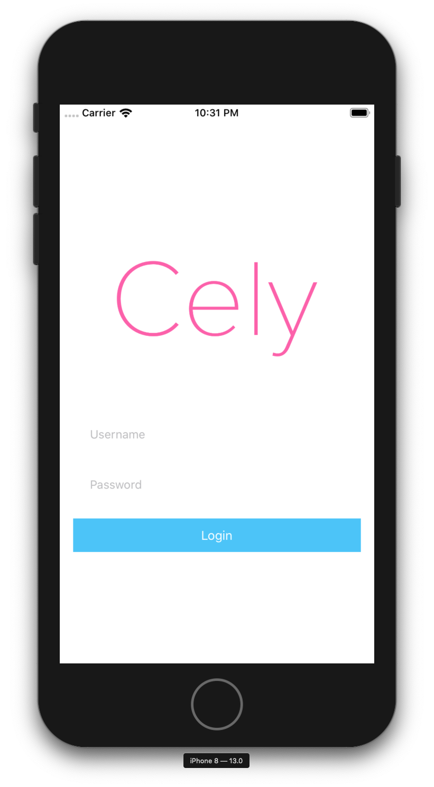
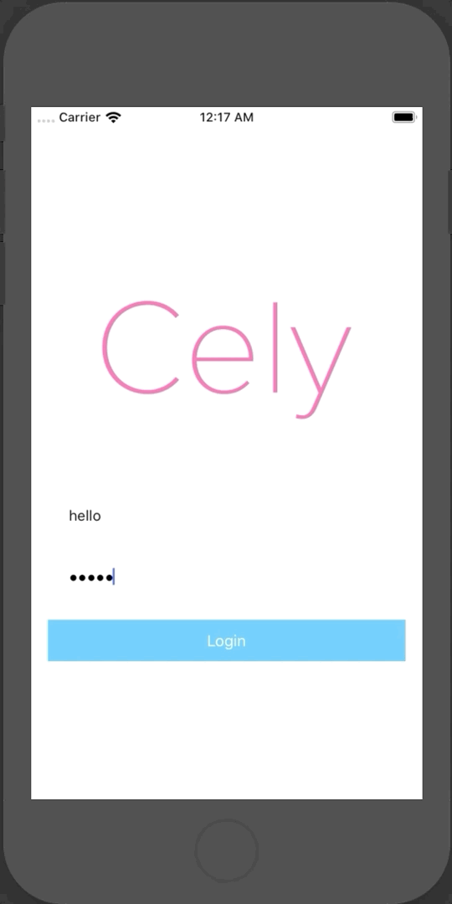

# Overview

<!--
THIS IS THE FIRST ENCOUNTER WITH THE PROJECT! NEEDS TO BE FAST!
-->

## Introduction

With the recent changes made to the [App's Life Cycle](https://developer.apple.com/documentation/uikit/app_and_environment/managing_your_app_s_life_cycle), depending on what version of iOS your application will support, you will need to call [`Cely.setup(_:)`](/api/cely#setupwithformodelrequiredpropertieswithoptions) in either your `AppDelegate` (_iOS 12 and earlier_) or `SceneDelegate` (_iOS 13 and later_). The rest of the guide will follow as if your application supports iOS 13 & later.

Cely has a few defaults to help with speedy development, one of which is to include a built-in `LoginViewController`. If you would like to use your own, checkout [setup own `LoginViewController`](/usage/advance_usage/#loginviewcontroller).


## Cely Setup
Let's start by creating a `User` model that conforms to the [`CelyUser`](http://celylog.in/api/#celyuser) Protocol:


```swift
import Cely

struct User: CelyUser {

  enum Property: CelyProperty {
      case token = "token"
  }
}
```

In your application's `SceneDelegate.swift`, paste the following:

```swift
// iOS 13 | Swift 5.0 | Xcode 11.0

import Cely

class SceneDelegate: UIResponder, UIWindowSceneDelegate {
    var window: UIWindow?
    func scene(_ scene: UIScene, willConnectTo session: UISceneSession, options connectionOptions: UIScene.ConnectionOptions) {

        if let windowScene = scene as? UIWindowScene {
            let window = UIWindow(windowScene: windowScene)
            self.window = window
            window.makeKeyAndVisible()

            Cely.setup(with: window, forModel: User(), requiredProperties: [.token], withOptions: [
                .homeViewController: UIHostingController(rootView: HomeContentView()),
                .loginCompletionBlock: { (username: String, password: String) in
                    if username == "hello" && password == "world" {
                        // Store credentials and login
                        print("Logging in...")
                    }
                }
            ])
        }

    }
}
```

Now hit **RUN** on Xcode. You should see Cely's default login screen. Provide the credentials below and click **Login**.

- username: `hello`
- password: `world`




## Save Credentials

Next, we need to save the credentials to Cely's secure storage using `Cely.credentials`. Finally, set the [`CelyStatus`](/api/constants#celystatus) to `.loggedIn` to trigger your application to login.

```swift
if username == "hello" && password == "world" {
    Cely.save("FAKETOKEN", forKey: "token", securely: true)
    Cely.credentials.set(
      username: username,
      password: password,
      server: "api.example.com"
    )
    Cely.changeStatus(to: .loggedIn)
}
```




## Code:

```swift
// iOS 13 | Swift 5.0 | Xcode 11.0

import Cely

struct User: CelyUser {

  enum Property: CelyProperty {
      case token = "token"
  }
}

class SceneDelegate: UIResponder, UIWindowSceneDelegate {
    var window: UIWindow?
    func scene(_ scene: UIScene, willConnectTo session: UISceneSession, options connectionOptions: UIScene.ConnectionOptions) {
        if let windowScene = scene as? UIWindowScene {
            let window = UIWindow(windowScene: windowScene)
            self.window = window
            window.makeKeyAndVisible()

            Cely.setup(with: window, forModel: User(), requiredProperties: [.token], withOptions: [
                // Application entry point
                .homeViewController: UIHostingController(rootView: HomeContentView()),
                // handle Cely's default loginViewController event
                .loginCompletionBlock: { (username: String, password: String) in
                    if username == "hello" && password == "world" {
                        Cely.save("FAKETOKEN", forKey: "token", securely: true)
                        Cely.credentials.set(
                          username: username,
                          password: password,
                          server: "api.example.com"
                        )
                        Cely.changeStatus(to: .loggedIn)
                    }
                }
            ])
        }
    }
}
```


## What's next?

- [Set custom `LoginViewController`](/usage/advance_usage/#loginviewcontroller)
